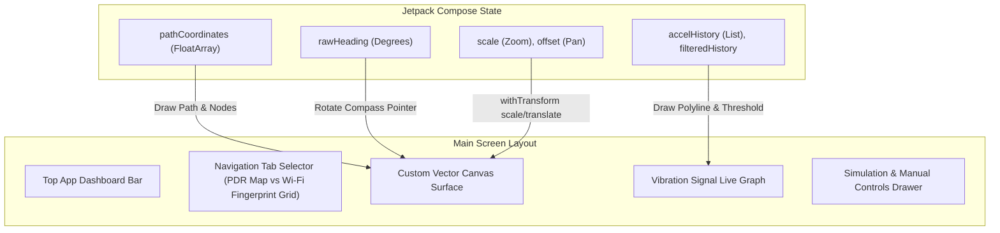

# UI & Dynamic Visualization Guide - IMU Motion Tracer

This document covers the user interface architecture, Jetpack Compose graphics pipeline, interactive vector Canvas rendering, gesture controls, and real-time visualization graphs in **IMU Motion Tracer**, complete with actual code implementations.

---

## 1. UI Layer Overview

The UI layer is written entirely in **Jetpack Compose**, adopting a dark obsidian and liquid glass design aesthetic (`DarkObsidian`, `GlassCardBg`, `GlowingCyan`).

Location: [`MainScreen.kt`](file:///c:/Users/user/Downloads/Inertial-Measurement-Unit-Based-Trajectory-Projection-Application-main%20%281%29/Inertial-Measurement-Unit-Based-Trajectory-Projection-Application-main/app/src/main/java/com/example/imumotiontracer/ui/main/MainScreen.kt#L104-L1380)



---

## 2. Interactive Map Vector Canvas

The map visualization is rendered on a hardware-accelerated Compose `Canvas` element with custom matrix transformations.

### 2.1 Gesture Transformation Matrix & Pointer Input
Pan and pinch-to-zoom gestures are captured using `pointerInput` with `detectTransformGestures`:

#### 💻 Actual Code Implementation
```kotlin
// Pan & Zoom Gesture Listener on Canvas Surface
var scale by remember { mutableStateOf(1.0f) }
var offset by remember { mutableStateOf(Offset.Zero) }

Canvas(
    modifier = Modifier
        .fillMaxSize()
        .pointerInput(Unit) {
            detectTransformGestures { _, pan, zoom, _ ->
                scale = (scale * zoom).coerceIn(0.2f, 8.0f)
                offset += pan
            }
        }
) {
    withTransform({
        translate(size.width / 2f + offset.x, size.height / 2f + offset.y)
        scale(scale, scale, Offset.Zero)
    }) {
        // Draw coordinate grid lines, path trajectory polylines, and step nodes
    }
}
```

---

### 2.2 Trajectory Polyline Vector Rendering
Within the `Canvas` draw scope, coordinates from `nativeEngine.getPathPoints()` are drawn:

#### 💻 Actual Code Implementation
```kotlin
// Draw continuous walking path polyline
if (pathCoordinates.size >= 4) {
    val path = Path()
    val startX = pathCoordinates[0] * 80f // 80 pixels per meter
    val startY = pathCoordinates[1] * 80f
    path.moveTo(startX, startY)

    for (i in 2 until pathCoordinates.size step 2) {
        val px = pathCoordinates[i] * 80f
        val py = pathCoordinates[i + 1] * 80f
        path.lineTo(px, py)
    }

    drawPath(
        path = path,
        color = GlowingCyan,
        style = Stroke(width = 4f / scale, cap = StrokeCap.Round)
    )
}
```

---

## 3. Real-Time Vibration Signal Graph

To calibrate dynamic step sensitivity ($a_{\text{threshold}}$) across different physical mobile devices, the UI renders a rolling 80-sample accelerometer magnitude line graph.

### 3.1 Data Flow & Canvas Graph Drawing
Raw magnitude $a_{\text{raw}}$ and zero-aligned LPF magnitude $a_{\text{filtered}}$ are appended to rolling FIFO lists:

#### 💻 Actual Code Implementation
```kotlin
// Live Accelerometer Vibration Canvas Graph
Canvas(modifier = Modifier.fillMaxWidth().height(120.dp)) {
    val width = size.width
    val height = size.height
    val stepX = width / (accelHistory.size - 1)

    // 1. Draw Cyan Raw Acceleration Magnitude Line
    for (i in 0 until accelHistory.size - 1) {
        val y1 = height - ((accelHistory[i] / 20f) * height)
        val y2 = height - ((accelHistory[i + 1] / 20f) * height)
        drawLine(
            color = GlowingCyan,
            start = Offset(i * stepX, y1),
            end = Offset((i + 1) * stepX, y2),
            strokeWidth = 2f
        )
    }

    // 2. Draw Red Dashed Dynamic Sensitivity Threshold Line
    val thresholdY = height - (((9.8f + sensitivity) / 20f) * height)
    drawLine(
        color = Color.Red,
        start = Offset(0f, thresholdY),
        end = Offset(width, thresholdY),
        strokeWidth = 2f,
        pathEffect = PathEffect.dashPathEffect(floatArrayOf(10f, 10f), 0f)
    )
}
```

---

## 4. Dual-Mode Operation & Simulator Engine

### 4.1 Automated Square Walk Simulator Routine
For automated test routines, coroutines drive step creation at defined intervals:

#### 💻 Actual Code Implementation
```kotlin
// Square Walk Automation Job
fun runSquareSimulation() {
    simulationJob?.cancel()
    simulationJob = coroutineScope.launch {
        val directions = listOf(0f, 90f, 180f, 270f)
        for (heading in directions) {
            for (step in 1..10) {
                delay(500) // 500ms pacing between steps
                nativeEngine.addStep(headingDegrees = heading, isSimulator = true)
                pathCoordinates = nativeEngine.getPathPoints()
                stepCount = nativeEngine.getStepCount()
                distance = nativeEngine.getDistance()
            }
        }
    }
}
```
